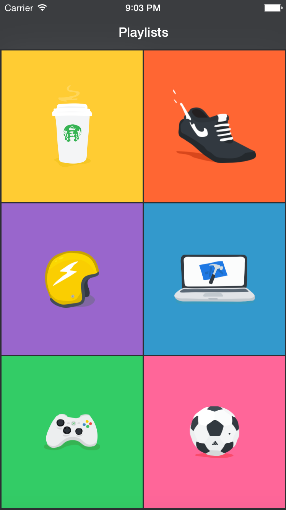
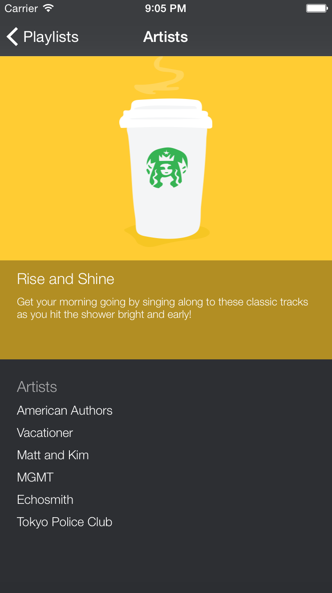
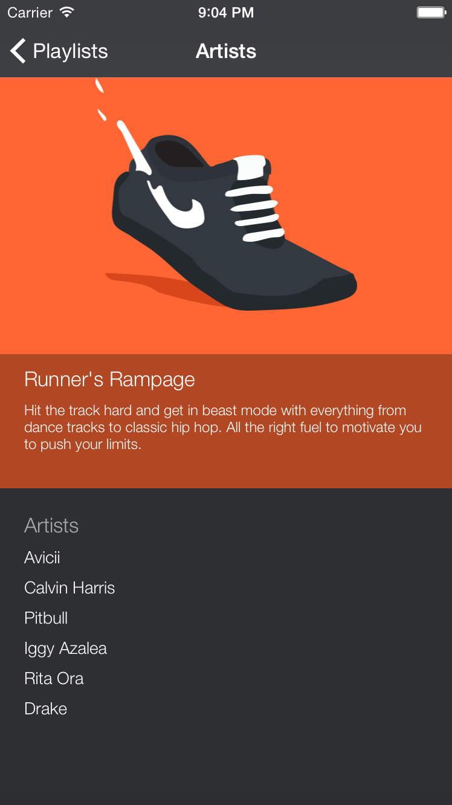

# Playlister
An iOS app written in Swift that allows the user to choose from a variety of different playlists. When a playlist is selected, they will be see a description of the playlist and a list of artists associated with it.

This was my second foray into the Swift language in which I learnt about the different navigational styles, data models, structs, how to connect the views with Segues and how to make use of touch gestures, all of which were incorporated into my app.

##Screenshots
<div align="center">
  
  
  
</div>

##Technology
- Swift
- Xcode

##To Run
You must have Xcode installed
```
$ git clone https://github.com/katebeavis/playlister-swift.git
$ cd playlister-swift
Open Xcode and click on the 'play' button to start the ios simulator
```
